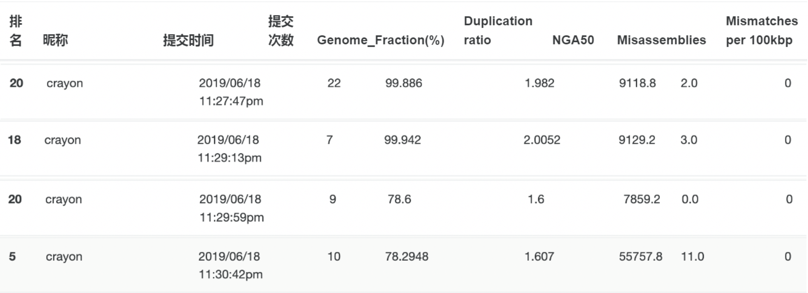

# genome-assembly

Assemble genomes with de Bruijn graph.

## Handout

[算法设计Project：宏基因组组装](http://datamining-iip.fudan.edu.cn/ppts/algo/PJ2018/index.html)

## Data

* 4 datasets are provided (`data4` are much larger), unzip them.

```
unzip data1.zip
unzip data2.zip
unzip data3.zip
unzip data4.zip
```

## Usage

* Set a much higher recursion limit as it reaches deep recursion depth running DFS(depth first search) in de Bruijn graph. Set a new recursion limit in python using:

```python
import sys
sys.setrecursionlimit(1000000)
```

* As `data4` is much larger than the others, the normal stack size is not likely to be enough. Set a much higher stack size by the following command (only for Linux).
You will get `Segmentation fault: 11` if the given stack size limit is reached.

```
ulimit -s 8192000
```

* Build de Bruijn gragh and output assembled genomes by:

```
python main.py data1
python main.py data2
python main.py data3
python main.py data4
```

## Result



## Implementation

Check `report.pdf` for details.

### build de Bruijn graph

```python
build_DBG(G(V, E), data):
    for each read in data:
        rc_read <- get_reverse_complement(read)
        for i <- 0 to len(read) - k:
        	add read[i: i + k], read[i + 1: i + 1 + k] into V
            add (read[i: i + k], read[i + 1: i + 1 + k]) into E
            add rc_read[i: i + k], rc_read[i + 1: i + 1 + k] into V
            add (rc_read[i: i + k], rc_read[i + 1: i + 1 + k]) into E
```

### DFS for longest directed path of a node

```python
get_depth(v):
	if v.visited is False:
        v.visited <- True
        max_depth <- 0
        max_child <- None
        for child in v.children:
            depth <- get_depth(child)
            if depth > max_depth:
                update max_depth, max_child
        v.depth <- max_depth + 1
        v.max_child <- max_child
    return v.depth
```

### get the longest path in DBG

```python
get_longest_path(G(V, E)):
	max_depth <- 0
	max_v <- None
	for v in V:
		depth <- get_depth(v)
		if depth > max_depth:
			update max_depth, max_child
	path <- []
	while max_v is not None:
		append max_v into path
		max_v <- max_v.max_child
	return path
```

### delete the longest path

```python
delete_path(G(V, E), path):
    for v in path:
        for father in v.father:
            delete v in father.children
      	for child in v.children:
            delete v in child.father
        delete v in V
```

## Author

Zhongyu Chen
